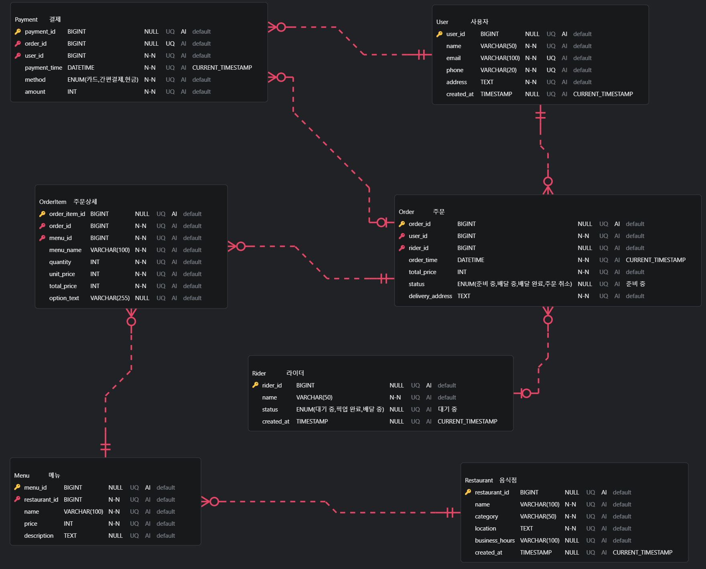

# 배달의민족 서비스 ERD 설계

> 배달의민족 음식 배달 서비스의 핵심 비즈니스 로직을 기반으로 관계형 데이터베이스 스키마를 정의하고, ERD(Entity Relationship Diagram)를 설계하였습니다.

---

## 🗂 목차

1. [ERD 다이어그램](#1-erd-다이어그램)
2. [테이블 스키마 정의](#-2-테이블-스키마-정의)
3. [엔티티 관계 정의](#-3-엔티티-관계-정의)
4. [추가 정의 및 설계 이유](#️-4-추가-정의-및-설계-이유)
5. [SQL 스키마](#-5-sql-스키마)

---

## 📌 1. ERD 다이어그램

 <!-- 이미지 파일 이름 또는 경로에 맞게 수정 -->

---

## 📘 2. 테이블 스키마 정의

| 테이블명       | 주요 컬럼 및 속성                                                                                                       | 설명               |
| -------------- | ----------------------------------------------------------------------------------------------------------------------- | ------------------ |
| **User**       | `user_id`(PK), `name`, `email`(UNIQUE), `phone`(UNIQUE), `address`, `created_at`                                        | 앱 사용자 정보     |
| **Restaurant** | `restaurant_id`(PK), `name`, `category`, `location`, `business_hours`, `created_at`                                     | 음식점 정보        |
| **Menu**       | `menu_id`(PK), `restaurant_id`(FK), `name`, `price`, `description`                                                      | 음식점의 메뉴      |
| **Order**      | `order_id`(PK), `user_id`(FK), `rider_id`(FK), `order_time`, `total_price`, `status`, `delivery_address`                | 사용자의 주문 정보 |
| **OrderItem**  | `order_item_id`(PK), `order_id`(FK), `menu_id`(FK), `menu_name`, `quantity`, `unit_price`, `total_price`, `option_text` | 주문 상세 항목     |
| **Payment**    | `payment_id`(PK), `order_id`(FK, UNIQUE), `user_id`(FK), `payment_time`, `method`, `amount`                             | 결제 정보          |
| **Rider**      | `rider_id`(PK), `name`, `status`, `created_at`                                                                          | 배달 기사 정보     |

---

## 🔗 3. 엔티티 관계 정의

| 관계                  | 다중성 | 식별관계 여부 | 설명                                            |
| --------------------- | ------ | ------------- | ----------------------------------------------- |
| `User` → `Order`      | 1:N    | 비식별        | 한 사용자는 여러 주문을 할 수 있음              |
| `Restaurant` → `Menu` | 1:N    | 비식별        | 한 음식점은 여러 개의 메뉴를 가질 수 있음       |
| `Order` → `OrderItem` | 1:N    | 비식별        | 하나의 주문은 여러 주문 항목을 포함함           |
| `Menu` → `OrderItem`  | 1:N    | 비식별        | 하나의 메뉴가 여러 주문 상세에서 사용될 수 있음 |
| `Order` → `Payment`   | 1:1    | 비식별        | 하나의 주문은 하나의 결제만 가짐                |
| `User` → `Payment`    | 1:N    | 비식별        | 사용자는 여러 번 결제할 수 있음                 |
| `Rider` → `Order`     | 1:N    | 비식별        | 한 라이더가 여러 주문을 담당할 수 있음          |

---

## 🛠️ 4. 추가 정의 및 설계 이유

| 테이블명    | 항목                                     | 설계 이유                                                               |
| ----------- | ---------------------------------------- | ----------------------------------------------------------------------- |
| `OrderItem` | `menu_name`, `unit_price`, `total_price` | 주문 시점의 메뉴 정보 보존 (가격 변동, 메뉴 삭제 시에도 이력 유지 목적) |
| `Payment`   | `method` (ENUM)                          | 카드, 간편결제, 현금 등 다양한 결제 방식을 명확하게 처리                |
| `Rider`     | `status` (ENUM)                          | 픽업, 배달 중, 대기 상태를 실시간으로 관리하기 위함                     |

---

## 📂 5. SQL 스키마

```sql
-- 1. 사용자 (User)
CREATE TABLE User (
    user_id BIGINT PRIMARY KEY AUTO_INCREMENT,
    name VARCHAR(50) NOT NULL,
    email VARCHAR(100) NOT NULL UNIQUE,
    phone VARCHAR(20) NOT NULL UNIQUE,
    address TEXT NOT NULL,
    created_at TIMESTAMP DEFAULT CURRENT_TIMESTAMP
);

-- 2. 음식점 (Restaurant)
CREATE TABLE Restaurant (
    restaurant_id BIGINT PRIMARY KEY AUTO_INCREMENT,
    name VARCHAR(100) NOT NULL,
    category VARCHAR(50) NOT NULL,
    location TEXT NOT NULL,
    business_hours VARCHAR(100),
    created_at TIMESTAMP DEFAULT CURRENT_TIMESTAMP
);

-- 3. 메뉴 (Menu)
CREATE TABLE Menu (
    menu_id BIGINT PRIMARY KEY AUTO_INCREMENT,
    restaurant_id BIGINT NOT NULL,
    name VARCHAR(100) NOT NULL,
    price INT NOT NULL,
    description TEXT,
    FOREIGN KEY (restaurant_id) REFERENCES Restaurant(restaurant_id)
);

-- 4. 라이더 (Rider)
CREATE TABLE Rider (
    rider_id BIGINT PRIMARY KEY AUTO_INCREMENT,
    name VARCHAR(50) NOT NULL,
    status ENUM('대기 중', '픽업 완료', '배달 중') DEFAULT '대기 중',
    created_at TIMESTAMP DEFAULT CURRENT_TIMESTAMP
);

-- 5. 주문 (Order)
CREATE TABLE `Order` (
    order_id BIGINT PRIMARY KEY AUTO_INCREMENT,
    user_id BIGINT NOT NULL,
    rider_id BIGINT,
    order_time DATETIME NOT NULL DEFAULT CURRENT_TIMESTAMP,
    total_price INT NOT NULL,
    status ENUM('준비 중', '배달 중', '배달 완료', '주문 취소') DEFAULT '준비 중',
    delivery_address TEXT NOT NULL,
    FOREIGN KEY (user_id) REFERENCES User(user_id),
    FOREIGN KEY (rider_id) REFERENCES Rider(rider_id)
);

-- 6. 주문 상세 (OrderItem)
CREATE TABLE OrderItem (
    order_item_id BIGINT PRIMARY KEY AUTO_INCREMENT,
    order_id BIGINT NOT NULL,
    menu_id BIGINT NOT NULL,
    menu_name VARCHAR(100) NOT NULL,
    quantity INT NOT NULL,
    unit_price INT NOT NULL,
    total_price INT NOT NULL,
    option_text VARCHAR(255),
    FOREIGN KEY (order_id) REFERENCES `Order`(order_id),
    FOREIGN KEY (menu_id) REFERENCES Menu(menu_id)
);

-- 7. 결제 (Payment)
CREATE TABLE Payment (
    payment_id BIGINT PRIMARY KEY AUTO_INCREMENT,
    order_id BIGINT UNIQUE NOT NULL,
    user_id BIGINT NOT NULL,
    payment_time DATETIME NOT NULL DEFAULT CURRENT_TIMESTAMP,
    method ENUM('카드', '간편결제', '현금') NOT NULL,
    amount INT NOT NULL,
    FOREIGN KEY (order_id) REFERENCES `Order`(order_id),
    FOREIGN KEY (user_id) REFERENCES User(user_id)
);
```
