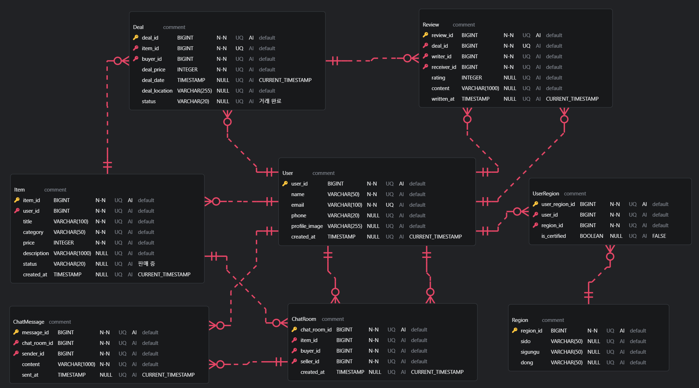

# 당근마켓 서비스 ERD 설계

> 당근마켓(지역 기반 중고거래 서비스)의 핵심 비즈니스 로직을 기반으로 관계형 데이터베이스 스키마를 정의하고, ERD(Entity Relationship Diagram)를 설계하였습니다.

---

## 🗂 목차

1. [ERD 다이어그램](#-1-erd-다이어그램)
2. [테이블 스키마 정의](#-2-테이블-스키마-정의)
3. [엔티티 관계 정의](#-3-엔티티-관계-정의)
4. [추가 정의 및 설계 이유](#️-4-추가-정의-및-설계-이유)
5. [SQL 스키마](#-5-sql-스키마)

---

## 📌 1. ERD 다이어그램

 <!-- 이미지 파일 이름 또는 경로에 맞게 수정 -->

---

## 📘 2. 테이블 스키마 정의

| 테이블명        | 주요 컬럼 및 속성                                                                                     | 설명                      |
| --------------- | ----------------------------------------------------------------------------------------------------- | ------------------------- |
| **User**        | `user_id`(PK), `name`, `email`(UNIQUE), `phone`, `profile_image`, `created_at`                        | 사용자 정보               |
| **Region**      | `region_id`(PK), `sido`, `sigungu`, `dong`                                                            | 행정구역 단위의 지역 정보 |
| **UserRegion**  | `user_region_id`(PK), `user_id`(FK), `region_id`(FK), `is_certified`                                  | 사용자-지역 매핑          |
| **Item**        | `item_id`(PK), `user_id`(FK), `title`, `category`, `price`, `description`, `status`, `created_at`     | 중고 물품 정보            |
| **ChatRoom**    | `chat_room_id`(PK), `item_id`(FK), `buyer_id`(FK), `seller_id`(FK), `created_at`                      | 채팅방 정보               |
| **ChatMessage** | `message_id`(PK), `chat_room_id`(FK), `sender_id`(FK), `content`, `sent_at`                           | 채팅 메시지               |
| **Deal**        | `deal_id`(PK), `item_id`(FK), `buyer_id`(FK), `deal_price`, `deal_date`, `deal_location`, `status`    | 거래 정보                 |
| **Review**      | `review_id`(PK), `deal_id`(FK), `writer_id`(FK), `receiver_id`(FK), `rating`, `content`, `written_at` | 거래 후 작성된 리뷰       |

---

## 🔗 3. 엔티티 관계 정의

| 관계                       | 다중성 | 식별관계 여부 | 설명                                     |
| -------------------------- | ------ | ------------- | ---------------------------------------- |
| `User` → `Item`            | 1:N    | 비식별        | 한 사용자는 여러 물품을 등록할 수 있음   |
| `User` → `UserRegion`      | 1:N    | 비식별        | 한 사용자가 여러 지역을 설정할 수 있음   |
| `Region` → `UserRegion`    | 1:N    | 비식별        | 하나의 지역에 여러 사용자가 거주 가능    |
| `Item` → `ChatRoom`        | 1:N    | 비식별        | 한 물품에 대해 여러 채팅방이 생성 가능   |
| `ChatRoom` → `ChatMessage` | 1:N    | 비식별        | 한 채팅방에 여러 메시지가 작성됨         |
| `User` → `ChatMessage`     | 1:N    | 비식별        | 한 사용자가 여러 메시지를 보낼 수 있음   |
| `Item` → `Deal`            | 1:1    | 비식별        | 한 물품은 하나의 거래 정보와 연결됨      |
| `Deal` → `Review`          | 1:1    | 비식별        | 거래가 완료되면 하나의 리뷰가 작성 가능  |
| `User` → `Review`          | 1:N    | 비식별        | 사용자는 여러 개의 리뷰를 작성할 수 있음 |

---

## 🛠️ 4. 추가 정의 및 설계 이유

| 테이블명     | 항목                       | 설계 이유                                           |
| ------------ | -------------------------- | --------------------------------------------------- |
| `UserRegion` | 중간 매핑 테이블           | 사용자와 지역 간 다대다 관계 해소                   |
| `ChatRoom`   | `buyer_id`, `seller_id`    | 채팅 참여자의 역할을 명확히 구분                    |
| `Review`     | `writer_id`, `receiver_id` | 사용자 간 상호 평가를 지원하기 위해 명시적으로 구분 |

---

## 📂 5. SQL 스키마

```sql
CREATE TABLE User (
    user_id BIGINT NOT NULL PRIMARY KEY,
    name VARCHAR(50) NOT NULL,
    email VARCHAR(100) NOT NULL UNIQUE,
    phone VARCHAR(20),
    profile_image VARCHAR(255),
    created_at TIMESTAMP DEFAULT CURRENT_TIMESTAMP
);

CREATE TABLE Region (
    region_id BIGINT NOT NULL PRIMARY KEY,
    sido VARCHAR(50),
    sigungu VARCHAR(50),
    dong VARCHAR(50)
);

CREATE TABLE UserRegion (
    user_region_id BIGINT NOT NULL PRIMARY KEY,
    user_id BIGINT NOT NULL,
    region_id BIGINT NOT NULL,
    is_certified BOOLEAN DEFAULT FALSE,
    FOREIGN KEY (user_id) REFERENCES User(user_id),
    FOREIGN KEY (region_id) REFERENCES Region(region_id)
);

CREATE TABLE Item (
    item_id BIGINT NOT NULL PRIMARY KEY,
    user_id BIGINT NOT NULL,
    title VARCHAR(100) NOT NULL,
    category VARCHAR(50) NOT NULL,
    price INTEGER NOT NULL,
    description VARCHAR(1000),
    status VARCHAR(20) DEFAULT '판매 중',
    created_at TIMESTAMP DEFAULT CURRENT_TIMESTAMP,
    FOREIGN KEY (user_id) REFERENCES User(user_id)
);

CREATE TABLE ChatRoom (
    chat_room_id BIGINT NOT NULL PRIMARY KEY,
    item_id BIGINT NOT NULL,
    buyer_id BIGINT NOT NULL,
    seller_id BIGINT NOT NULL,
    created_at TIMESTAMP DEFAULT CURRENT_TIMESTAMP,
    FOREIGN KEY (item_id) REFERENCES Item(item_id),
    FOREIGN KEY (buyer_id) REFERENCES User(user_id),
    FOREIGN KEY (seller_id) REFERENCES User(user_id)
);

CREATE TABLE ChatMessage (
    message_id BIGINT NOT NULL PRIMARY KEY,
    chat_room_id BIGINT NOT NULL,
    sender_id BIGINT NOT NULL,
    content VARCHAR(1000) NOT NULL,
    sent_at TIMESTAMP DEFAULT CURRENT_TIMESTAMP,
    FOREIGN KEY (chat_room_id) REFERENCES ChatRoom(chat_room_id),
    FOREIGN KEY (sender_id) REFERENCES User(user_id)
);

CREATE TABLE Deal (
    deal_id BIGINT NOT NULL PRIMARY KEY,
    item_id BIGINT NOT NULL UNIQUE,
    buyer_id BIGINT NOT NULL,
    deal_price INTEGER NOT NULL,
    deal_date TIMESTAMP DEFAULT CURRENT_TIMESTAMP,
    deal_location VARCHAR(255),
    status VARCHAR(20) DEFAULT '거래 완료',
    FOREIGN KEY (item_id) REFERENCES Item(item_id),
    FOREIGN KEY (buyer_id) REFERENCES User(user_id)
);

CREATE TABLE Review (
    review_id BIGINT NOT NULL PRIMARY KEY,
    deal_id BIGINT NOT NULL UNIQUE,
    writer_id BIGINT NOT NULL,
    receiver_id BIGINT NOT NULL,
    rating INTEGER,
    content VARCHAR(1000),
    written_at TIMESTAMP DEFAULT CURRENT_TIMESTAMP,
    FOREIGN KEY (deal_id) REFERENCES Deal(deal_id),
    FOREIGN KEY (writer_id) REFERENCES User(user_id),
    FOREIGN KEY (receiver_id) REFERENCES User(user_id)
);
```
