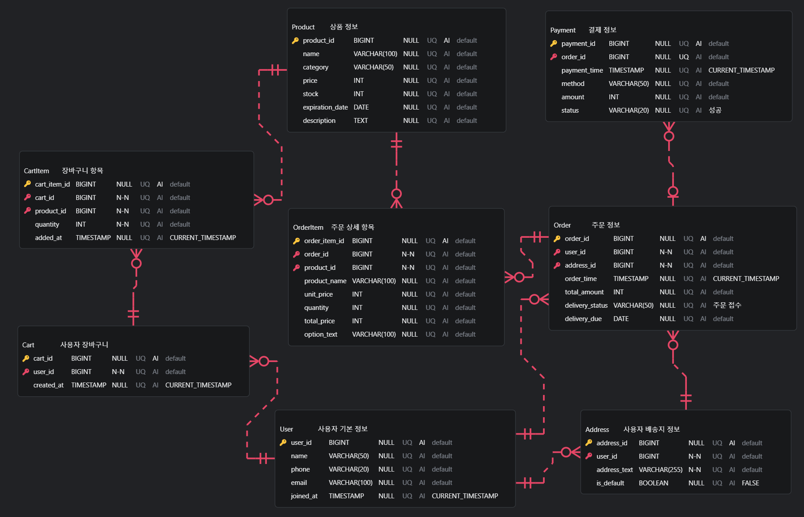

# 마켓컬리 서비스 ERD 설계

> 마켓컬리(신선식품 새벽 배송 서비스)의 핵심 비즈니스 로직을 기반으로 관계형 데이터베이스 스키마를 정의하고, ERD(Entity Relationship Diagram)를 설계하였습니다.

---

## 🗂 목차

1. [ERD 다이어그램](#-1-erd-다이어그램)
2. [테이블 스키마 정의](#-2-테이블-스키마-정의)
3. [엔티티 관계 정의](#-3-엔티티-관계-정의)
4. [추가 정의 및 설계 이유](#️-4-추가-정의-및-설계-이유)
5. [SQL 스키마](#-5-sql-스키마)

---

## 📌 1. ERD 다이어그램



---

## 📘 2. 테이블 스키마 정의

| 테이블명      | 주요 컬럼 및 속성                                                                                                             | 설명               |
| ------------- | ----------------------------------------------------------------------------------------------------------------------------- | ------------------ |
| **User**      | `user_id`(PK), `name`, `phone`, `email`, `joined_at`                                                                          | 사용자 기본 정보   |
| **Address**   | `address_id`(PK), `user_id`(FK), `address_text`, `is_default`                                                                 | 사용자 배송지 정보 |
| **Product**   | `product_id`(PK), `name`, `category`, `price`, `stock`, `expiration_date`, `description`                                      | 상품 정보          |
| **Cart**      | `cart_id`(PK), `user_id`(FK), `created_at`                                                                                    | 사용자 장바구니    |
| **CartItem**  | `cart_item_id`(PK), `cart_id`(FK), `product_id`(FK), `quantity`, `added_at`                                                   | 장바구니 항목      |
| **Order**     | `order_id`(PK), `user_id`(FK), `address_id`(FK), `order_time`, `total_amount`, `delivery_status`, `delivery_due`              | 주문 정보          |
| **OrderItem** | `order_item_id`(PK), `order_id`(FK), `product_id`(FK), `product_name`, `unit_price`, `quantity`, `total_price`, `option_text` | 주문 상세 항목     |
| **Payment**   | `payment_id`(PK), `order_id`(FK, UNIQUE), `payment_time`, `method`, `amount`, `status`                                        | 결제 정보          |

---

## 🔗 3. 엔티티 관계 정의

| 관계                    | 다중성 | 식별관계 여부 | 설명                                       |
| ----------------------- | ------ | ------------- | ------------------------------------------ |
| `User` → `Address`      | 1:N    | 비식별        | 사용자는 여러 배송지를 가질 수 있음        |
| `User` → `Cart`         | 1:1    | 비식별        | 사용자마다 하나의 장바구니 보유 가능       |
| `Cart` → `CartItem`     | 1:N    | 비식별        | 장바구니에 여러 상품 추가 가능             |
| `Product` → `CartItem`  | 1:N    | 비식별        | 하나의 상품이 여러 장바구니에 담길 수 있음 |
| `User` → `Order`        | 1:N    | 비식별        | 사용자마다 여러 주문 가능                  |
| `Order` → `OrderItem`   | 1:N    | 비식별        | 한 주문에 여러 상품 포함 가능              |
| `Product` → `OrderItem` | 1:N    | 비식별        | 상품 기준으로 여러 주문 상세에 포함 가능   |
| `Order` → `Payment`     | 1:1    | 비식별        | 하나의 주문당 하나의 결제 연결             |

---

## 🛠️ 4. 추가 정의 및 설계 이유

| 테이블명    | 항목                   | 설계 이유                          |
| ----------- | ---------------------- | ---------------------------------- |
| `CartItem`  | 수량, 담은 시점        | 장바구니 내 상품 수량 및 시점 관리 |
| `OrderItem` | 옵션, 단가, 수량, 총액 | 실제 주문 시점 상품 정보 보존용    |
| `Payment`   | 결제 수단, 상태        | 결제 성공/실패 구분 및 분석 목적   |

---

## 📂 5. SQL 스키마

```sql
CREATE TABLE User (
    user_id BIGINT PRIMARY KEY AUTO_INCREMENT,
    name VARCHAR(50),
    phone VARCHAR(20),
    email VARCHAR(100),
    joined_at TIMESTAMP DEFAULT CURRENT_TIMESTAMP
);

CREATE TABLE Address (
    address_id BIGINT PRIMARY KEY AUTO_INCREMENT,
    user_id BIGINT NOT NULL,
    address_text VARCHAR(255) NOT NULL,
    is_default BOOLEAN DEFAULT FALSE,
    FOREIGN KEY (user_id) REFERENCES User(user_id)
);

CREATE TABLE Product (
    product_id BIGINT PRIMARY KEY AUTO_INCREMENT,
    name VARCHAR(100),
    category VARCHAR(50),
    price INT,
    stock INT,
    expiration_date DATE,
    description TEXT
);

CREATE TABLE Cart (
    cart_id BIGINT PRIMARY KEY AUTO_INCREMENT,
    user_id BIGINT NOT NULL,
    created_at TIMESTAMP DEFAULT CURRENT_TIMESTAMP,
    FOREIGN KEY (user_id) REFERENCES User(user_id)
);

CREATE TABLE CartItem (
    cart_item_id BIGINT PRIMARY KEY AUTO_INCREMENT,
    cart_id BIGINT NOT NULL,
    product_id BIGINT NOT NULL,
    quantity INT NOT NULL,
    added_at TIMESTAMP DEFAULT CURRENT_TIMESTAMP,
    FOREIGN KEY (cart_id) REFERENCES Cart(cart_id),
    FOREIGN KEY (product_id) REFERENCES Product(product_id)
);

CREATE TABLE `Order` (
    order_id BIGINT PRIMARY KEY AUTO_INCREMENT,
    user_id BIGINT NOT NULL,
    address_id BIGINT NOT NULL,
    order_time TIMESTAMP DEFAULT CURRENT_TIMESTAMP,
    total_amount INT,
    delivery_status VARCHAR(50) DEFAULT '주문 접수',
    delivery_due DATE,
    FOREIGN KEY (user_id) REFERENCES User(user_id),
    FOREIGN KEY (address_id) REFERENCES Address(address_id)
);

CREATE TABLE OrderItem (
    order_item_id BIGINT PRIMARY KEY AUTO_INCREMENT,
    order_id BIGINT NOT NULL,
    product_id BIGINT NOT NULL,
    product_name VARCHAR(100),
    unit_price INT,
    quantity INT,
    total_price INT,
    option_text VARCHAR(100),
    FOREIGN KEY (order_id) REFERENCES `Order`(order_id),
    FOREIGN KEY (product_id) REFERENCES Product(product_id)
);

CREATE TABLE Payment (
    payment_id BIGINT PRIMARY KEY AUTO_INCREMENT,
    order_id BIGINT UNIQUE NOT NULL,
    payment_time TIMESTAMP DEFAULT CURRENT_TIMESTAMP,
    method VARCHAR(50),
    amount INT,
    status VARCHAR(20) DEFAULT '성공',
    FOREIGN KEY (order_id) REFERENCES `Order`(order_id)
);
```
