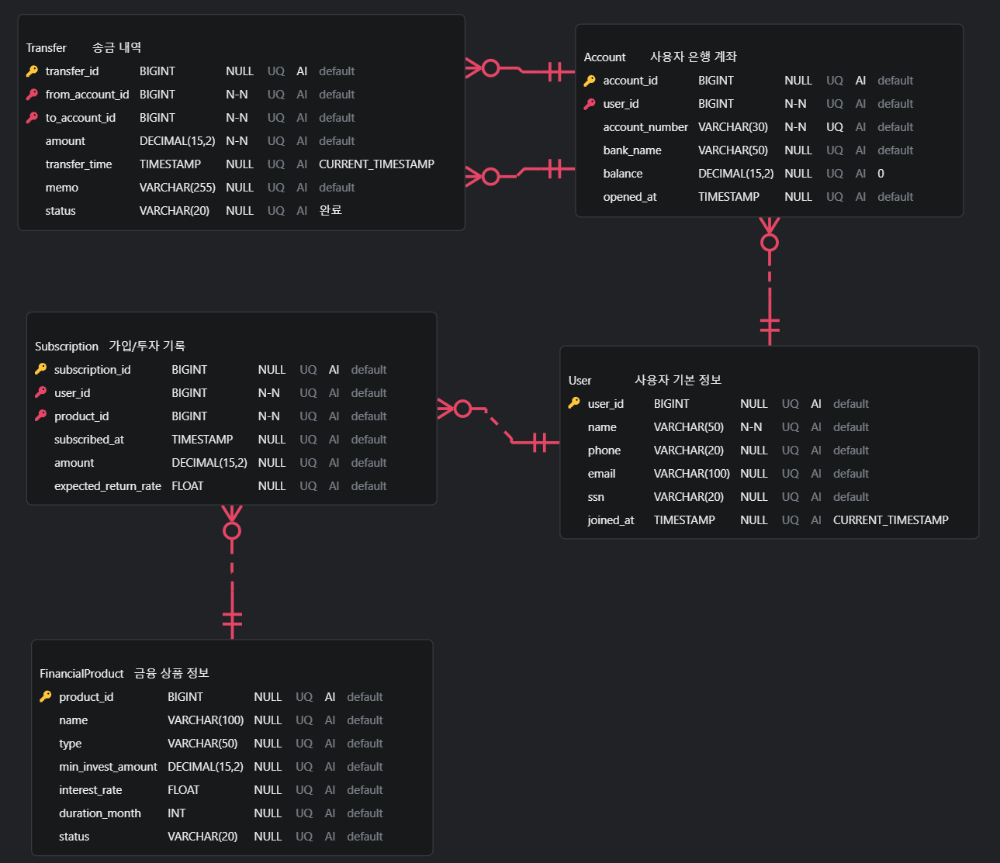

# 토스 서비스 ERD 설계

> 토스(간편 금융 서비스)의 핵심 비즈니스 로직을 기반으로 관계형 데이터베이스 스키마를 정의하고, ERD(Entity Relationship Diagram)를 설계하였습니다.

---

## 🗂 목차

1. [ERD 다이어그램](#-1-erd-다이어그램)
2. [테이블 스키마 정의](#-2-테이블-스키마-정의)
3. [엔티티 관계 정의](#-3-엔티티-관계-정의)
4. [추가 정의 및 설계 이유](#️-4-추가-정의-및-설계-이유)
5. [SQL 스키마](#-5-sql-스키마)

---

## 📌 1. ERD 다이어그램



---

## 📘 2. 테이블 스키마 정의

| 테이블명             | 주요 컬럼 및 속성                                                                                         | 설명             |
| -------------------- | --------------------------------------------------------------------------------------------------------- | ---------------- |
| **User**             | `user_id`(PK), `name`, `phone`, `email`, `ssn`, `joined_at`                                               | 사용자 기본 정보 |
| **Account**          | `account_id`(PK), `user_id`(FK), `account_number`, `bank_name`, `balance`, `opened_at`                    | 사용자 은행 계좌 |
| **Transfer**         | `transfer_id`(PK), `from_account_id`, `to_account_id`, `amount`, `transfer_time`, `memo`, `status`        | 송금 내역        |
| **FinancialProduct** | `product_id`(PK), `name`, `type`, `min_invest_amount`, `interest_rate`, `duration_month`, `status`        | 금융 상품 정보   |
| **Subscription**     | `subscription_id`(PK), `user_id`(FK), `product_id`(FK), `subscribed_at`, `amount`, `expected_return_rate` | 가입/투자 기록   |

---

## 🔗 3. 엔티티 관계 정의

| 관계                                | 다중성 | 식별관계 여부 | 설명                                      |
| ----------------------------------- | ------ | ------------- | ----------------------------------------- |
| `User` → `Account`                  | 1:N    | 비식별        | 한 사용자가 여러 은행 계좌를 가질 수 있음 |
| `Account` → `Transfer` (출금)       | 1:N    | 비식별        | 출금 계좌 기준 여러 송금 발생 가능        |
| `Account` → `Transfer` (입금)       | 1:N    | 비식별        | 입금 계좌 기준 여러 송금 수신 가능        |
| `User` → `Subscription`             | 1:N    | 비식별        | 사용자가 여러 금융상품에 가입 가능        |
| `FinancialProduct` → `Subscription` | 1:N    | 비식별        | 하나의 상품에 여러 사용자 가입 가능       |

---

## 🛠️ 4. 추가 정의 및 설계 이유

| 테이블명       | 항목                   | 설계 이유                            |
| -------------- | ---------------------- | ------------------------------------ |
| `Transfer`     | `memo`, `status`       | 거래 기록의 상태 및 설명 기록용      |
| `Subscription` | `expected_return_rate` | 예상 수익률(또는 현재 평가금액) 포함 |
| `Account`      | `balance`              | 실시간 잔액 관리용                   |

---

## 📂 5. SQL 스키마

```sql
CREATE TABLE User (
    user_id BIGINT PRIMARY KEY AUTO_INCREMENT,
    name VARCHAR(50) NOT NULL,
    phone VARCHAR(20),
    email VARCHAR(100),
    ssn VARCHAR(20),
    joined_at TIMESTAMP DEFAULT CURRENT_TIMESTAMP
);

CREATE TABLE Account (
    account_id BIGINT PRIMARY KEY AUTO_INCREMENT,
    user_id BIGINT NOT NULL,
    account_number VARCHAR(30) NOT NULL UNIQUE,
    bank_name VARCHAR(50),
    balance DECIMAL(15, 2) DEFAULT 0,
    opened_at TIMESTAMP,
    FOREIGN KEY (user_id) REFERENCES User(user_id)
);

CREATE TABLE Transfer (
    transfer_id BIGINT PRIMARY KEY AUTO_INCREMENT,
    from_account_id BIGINT NOT NULL,
    to_account_id BIGINT NOT NULL,
    amount DECIMAL(15, 2) NOT NULL,
    transfer_time TIMESTAMP DEFAULT CURRENT_TIMESTAMP,
    memo VARCHAR(255),
    status VARCHAR(20) DEFAULT '완료',
    FOREIGN KEY (from_account_id) REFERENCES Account(account_id),
    FOREIGN KEY (to_account_id) REFERENCES Account(account_id)
);

CREATE TABLE FinancialProduct (
    product_id BIGINT PRIMARY KEY AUTO_INCREMENT,
    name VARCHAR(100),
    type VARCHAR(50),
    min_invest_amount DECIMAL(15, 2),
    interest_rate FLOAT,
    duration_month INT,
    status VARCHAR(20)
);

CREATE TABLE Subscription (
    subscription_id BIGINT PRIMARY KEY AUTO_INCREMENT,
    user_id BIGINT NOT NULL,
    product_id BIGINT NOT NULL,
    subscribed_at TIMESTAMP,
    amount DECIMAL(15, 2),
    expected_return_rate FLOAT,
    FOREIGN KEY (user_id) REFERENCES User(user_id),
    FOREIGN KEY (product_id) REFERENCES FinancialProduct(product_id)
);
```
