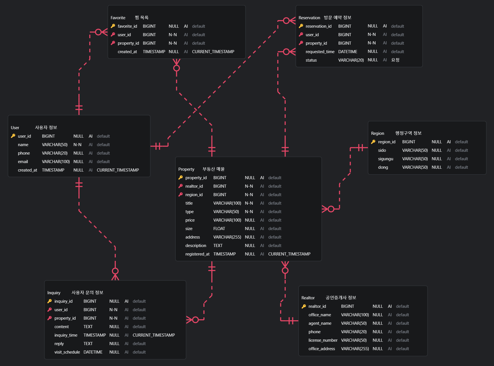

# 직방 서비스 ERD 설계

> 직방(부동산 매물 중개 플랫폼)의 핵심 비즈니스 로직을 기반으로 관계형 데이터베이스 스키마를 정의하고, ERD(Entity Relationship Diagram)를 설계하였습니다.

---

## 🗂 목차

1. [ERD 다이어그램](#-1-erd-다이어그램)
2. [테이블 스키마 정의](#-2-테이블-스키마-정의)
3. [엔티티 관계 정의](#-3-엔티티-관계-정의)
4. [추가 정의 및 설계 이유](#️-4-추가-정의-및-설계-이유)
5. [SQL 스키마](#-5-sql-스키마)

---

## 📌 1. ERD 다이어그램



---

## 📘 2. 테이블 스키마 정의

| 테이블명        | 주요 컬럼 및 속성                                                                                                                 | 설명             |
| --------------- | --------------------------------------------------------------------------------------------------------------------------------- | ---------------- |
| **User**        | `user_id`(PK), `name`, `phone`, `email`, `created_at`                                                                             | 사용자 정보      |
| **Region**      | `region_id`(PK), `sido`, `sigungu`, `dong`                                                                                        | 행정구역 정보    |
| **Realtor**     | `realtor_id`(PK), `office_name`, `agent_name`, `phone`, `license_number`, `office_address`                                        | 공인중개사 정보  |
| **Property**    | `property_id`(PK), `realtor_id`(FK), `region_id`(FK), `title`, `type`, `price`, `size`, `address`, `description`, `registered_at` | 부동산 매물      |
| **Favorite**    | `favorite_id`(PK), `user_id`(FK), `property_id`(FK), `created_at`                                                                 | 찜 목록          |
| **Inquiry**     | `inquiry_id`(PK), `user_id`(FK), `property_id`(FK), `content`, `inquiry_time`, `reply`, `visit_schedule`                          | 사용자 문의 정보 |
| **Reservation** | `reservation_id`(PK), `user_id`(FK), `property_id`(FK), `requested_time`, `status`                                                | 방문 예약 정보   |

---

## 🔗 3. 엔티티 관계 정의

| 관계                       | 다중성 | 식별관계 여부 | 설명                              |
| -------------------------- | ------ | ------------- | --------------------------------- |
| `User` → `Favorite`        | 1:N    | 비식별        | 사용자가 여러 매물에 찜 가능      |
| `User` → `Inquiry`         | 1:N    | 비식별        | 한 사용자가 여러 매물에 문의 가능 |
| `User` → `Reservation`     | 1:N    | 비식별        | 한 사용자가 여러 방문 예약 가능   |
| `Realtor` → `Property`     | 1:N    | 비식별        | 한 중개사가 여러 매물 보유        |
| `Property` → `Favorite`    | 1:N    | 비식별        | 매물 기준으로 여러 찜 가능        |
| `Property` → `Inquiry`     | 1:N    | 비식별        | 매물 기준으로 여러 문의 가능      |
| `Property` → `Reservation` | 1:N    | 비식별        | 매물 기준으로 여러 예약 가능      |
| `Region` → `Property`      | 1:N    | 비식별        | 한 지역에 여러 매물 위치 가능     |

---

## 🛠️ 4. 추가 정의 및 설계 이유

| 테이블명      | 항목                      | 설계 이유                                  |
| ------------- | ------------------------- | ------------------------------------------ |
| `Favorite`    | 중간 테이블 구성          | 사용자와 매물 간 N:M 관계 해결용           |
| `Inquiry`     | `reply`, `visit_schedule` | 답변 및 방문 희망 일자 정보 포함           |
| `Reservation` | `status`                  | 예약 승인, 거절, 완료 등의 상태관리 필수   |
| `Property`    | `region_id`               | 매물의 위치와 지역 연계를 통한 필터링 지원 |

---

## 📂 5. SQL 스키마

```sql
CREATE TABLE User (
    user_id BIGINT PRIMARY KEY AUTO_INCREMENT,
    name VARCHAR(50) NOT NULL,
    phone VARCHAR(20),
    email VARCHAR(100),
    created_at TIMESTAMP DEFAULT CURRENT_TIMESTAMP
);

CREATE TABLE Region (
    region_id BIGINT PRIMARY KEY AUTO_INCREMENT,
    sido VARCHAR(50),
    sigungu VARCHAR(50),
    dong VARCHAR(50)
);

CREATE TABLE Realtor (
    realtor_id BIGINT PRIMARY KEY AUTO_INCREMENT,
    office_name VARCHAR(100),
    agent_name VARCHAR(50),
    phone VARCHAR(20),
    license_number VARCHAR(50),
    office_address VARCHAR(255)
);

CREATE TABLE Property (
    property_id BIGINT PRIMARY KEY AUTO_INCREMENT,
    realtor_id BIGINT NOT NULL,
    region_id BIGINT NOT NULL,
    title VARCHAR(100) NOT NULL,
    type VARCHAR(50) NOT NULL,
    price VARCHAR(100),
    size FLOAT,
    address VARCHAR(255),
    description TEXT,
    registered_at TIMESTAMP DEFAULT CURRENT_TIMESTAMP,
    FOREIGN KEY (realtor_id) REFERENCES Realtor(realtor_id),
    FOREIGN KEY (region_id) REFERENCES Region(region_id)
);

CREATE TABLE Favorite (
    favorite_id BIGINT PRIMARY KEY AUTO_INCREMENT,
    user_id BIGINT NOT NULL,
    property_id BIGINT NOT NULL,
    created_at TIMESTAMP DEFAULT CURRENT_TIMESTAMP,
    FOREIGN KEY (user_id) REFERENCES User(user_id),
    FOREIGN KEY (property_id) REFERENCES Property(property_id)
);

CREATE TABLE Inquiry (
    inquiry_id BIGINT PRIMARY KEY AUTO_INCREMENT,
    user_id BIGINT NOT NULL,
    property_id BIGINT NOT NULL,
    content TEXT,
    inquiry_time TIMESTAMP DEFAULT CURRENT_TIMESTAMP,
    reply TEXT,
    visit_schedule DATETIME,
    FOREIGN KEY (user_id) REFERENCES User(user_id),
    FOREIGN KEY (property_id) REFERENCES Property(property_id)
);

CREATE TABLE Reservation (
    reservation_id BIGINT PRIMARY KEY AUTO_INCREMENT,
    user_id BIGINT NOT NULL,
    property_id BIGINT NOT NULL,
    requested_time DATETIME,
    status VARCHAR(20) DEFAULT '요청',
    FOREIGN KEY (user_id) REFERENCES User(user_id),
    FOREIGN KEY (property_id) REFERENCES Property(property_id)
);
```
